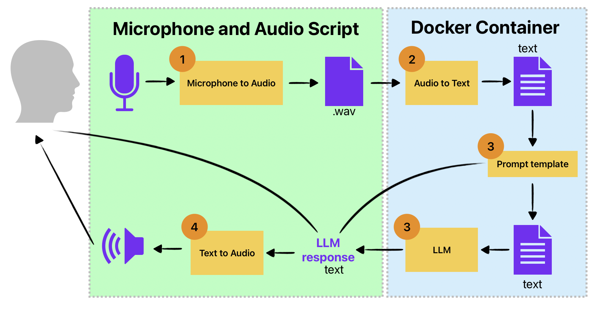

Code for Language Bot (light weight) to support langage conversation.
Currently tuned for Japanese
Objective: To be able to run locally on computer OR Raspberry Pi.

To run:

1. Packages needed:
```
sounddevice
soundfile
numpy
```

2. First run:
`docker-compose up --build`

3. Run:
`python record_and_play_devices.py`

